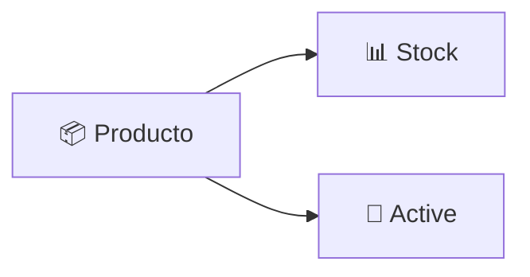

<div align="center">

# 🛍️ Producto Service

### Microservicio de gestión de catálogo e inventario
#### ElectrodoStore · Spring Boot · OAuth2 Resource Server


</div>

---

Producto Service es responsable de la administración del catálogo e inventario dentro de **ElectrodoStore**.

Centraliza la información de productos utilizada por otros dominios del sistema y actúa como fuente de verdad para consultas, validación y actualización de stock.

Implementa seguridad basada en **OAuth2 Resource Server** y control de acceso mediante roles.

---

## 🎯 Responsabilidades

- 🛍️ Gestión del catálogo de productos
- 📦 Administración de inventario
- 🔍 Consulta de productos
- ➕ Registro de productos
- ✏️ Actualización de productos
- 🚫 Deshabilitación lógica de productos
- 📉 Descuento de stock
- 📈 Reposición de stock
- ✅ Validación de disponibilidad de inventario

---

## 🧰 Stack tecnológico


---

## 📦 Modelo de dominio



### Entidad Producto

| Campo | Descripción |
| --- | --- |
| `id` | Identificador del producto |
| `name` | Nombre comercial |
| `stock` | Cantidad disponible |
| `price` | Precio unitario |
| `description` | Descripción |
| `active` | Estado lógico del producto |

---

## 🔐 Modelo de seguridad

Producto Service funciona como **OAuth2 Resource Server**. Los JWT emitidos por Auth Service son validados localmente mediante RSA256.

<table>
<tr>
<th>👨‍💼 Acceso administrativo</th>
<th>🔗 Acceso operacional</th>
</tr>
<tr>
<td>

Reservado para usuarios con rol `ADMIN`:
- Crear productos
- Actualizar productos
- Deshabilitar productos

</td>
<td>

Utilizado durante procesos de negocio:
- Consultar múltiples productos
- Validar stock
- Descontar stock
- Reponer stock

</td>
</tr>
</table>

---

## 📦 Gestión de inventario

El inventario se administra directamente desde este servicio mediante operaciones especializadas, utilizadas principalmente por 🛒 `carrito-service` y 💳 `venta-service`.

| Operación | Descripción |
| --- | --- |
| **Verificar stock** | Comprueba disponibilidad |
| **Descontar stock** | Reduce existencias |
| **Reponer stock** | Incrementa existencias |

---

## 🚫 Borrado lógico

Los productos no se eliminan físicamente. Cuando un producto deja de estar disponible se marca como inactivo mediante `active = false`, lo que permite:

- Preservar referencias históricas
- Mantener consistencia en ventas previas
- Evitar pérdida de información

---

## ⚠️ Manejo de errores

Se utiliza manejo centralizado mediante `@RestControllerAdvice`.

### Excepciones de dominio

| Excepción | Descripción |
| --- | --- |
| `ProductoNotFoundException` | Producto inexistente |
| `StockInsuficienteException` | Inventario insuficiente |

```json
{
  "timestamp": "...",
  "status": 409,
  "error": "CONFLICT",
  "errorCode": "PRODUCT_STOCK_INSUFICIENTE",
  "mensaje": "Stock insuficiente"
}
```

---

## 🌐 Endpoints

### 👨‍💼 Administración

| Método | Endpoint | Descripción |
| --- | --- | --- |
| `POST` | `/productos` | Crear producto |
| `PUT` | `/productos/{id}` | Actualizar producto |
| `PATCH` | `/productos/{id}` | Actualización parcial |
| `PATCH` | `/productos/{id}/disable` | Deshabilitar producto |

### 📖 Consulta

| Método | Endpoint | Descripción |
| --- | --- | --- |
| `GET` | `/productos` | Listar productos |
| `GET` | `/productos/{id}` | Obtener producto |

### 🔗 Operaciones de inventario

| Método | Endpoint | Descripción |
| --- | --- | --- |
| `POST` | `/productos/search` | Consultar productos por IDs |
| `POST` | `/productos/stock/verificar` | Verificar stock |
| `PATCH` | `/productos/stock/descontar` | Descontar stock |
| `PATCH` | `/productos/stock/reponer` | Reponer stock |

> ⚠️ Actualmente los endpoints operacionales utilizan JWT de usuario propagado entre microservicios. En futuras versiones se implementará autenticación específica entre servicios (M2M).

---

## 🏗️ Arquitectura

- 🌐 Acceso mediante API Gateway
- 🔐 OAuth2 Resource Server
- 🛡️ Control de acceso basado en roles
- 📦 Gestión centralizada del catálogo
- 📊 Administración centralizada de inventario
- 🔍 Descubrimiento mediante Eureka
- 🗄️ Database per Service

---

## 💡 Decisiones de diseño

<details>
<summary><b>📦 Catálogo centralizado</b></summary>
<br>
Producto Service es la única fuente de verdad para información de productos e inventario dentro del sistema.
</details>

<details>
<summary><b>🚫 Borrado lógico</b></summary>
<br>
Los productos se deshabilitan en lugar de eliminarse físicamente para preservar referencias históricas y mantener consistencia en otros dominios.
</details>

<details>
<summary><b>📊 Inventario centralizado</b></summary>
<br>
Las operaciones de stock se concentran en un único servicio para evitar inconsistencias entre procesos de compra y venta.
</details>

<details>
<summary><b>🗄️ Database per Service</b></summary>
<br>
El servicio mantiene su propia base de datos y no comparte persistencia con otros dominios.
</details>

---

## 🚀 Mejoras futuras

| Mejora | Descripción |
| --- | --- |
| 🔑 **M2M Auth** | Autenticación específica entre microservicios |
| 📄 **Paginación** | Consultas paginadas del catálogo |
| 🔎 **Filtros avanzados** | Búsquedas por nombre, rango de precio y estado |
| ⚡ **Cache** | Optimización de consultas frecuentes |
| 📡 **Observabilidad** | Tracing distribuido y métricas |
| 📸 **Gestión multimedia** | Soporte para imágenes de productos |

